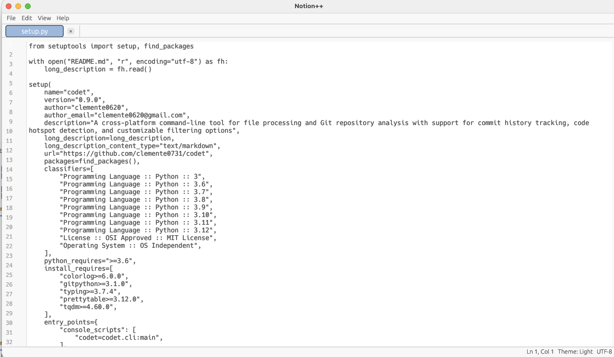

# Notion++ Text Editor

A modern, cross-platform text editor written in Rust, inspired by Notepad++.



## Features

- Cross-platform (Windows, macOS, Linux)
- Modern, clean UI with customizable themes
- Syntax highlighting for multiple programming languages
- Multiple document tabs
- Line numbers and word wrap
- Search and replace functionality
- Customizable settings

## Screenshots

_Screenshots will be added once the application is running._

## Building from Source

### Prerequisites

- Rust 1.70 or later
- Cargo (comes with Rust)

### Build Steps

```bash
# Clone the repository
git clone https://github.com/yourusername/notion-plus-plus.git
cd notion-plus-plus

# Build in release mode
cargo build --release

# Run the application
cargo run --release
```

The compiled binary will be in `target/release/notion_plus_plus`.

## Installation

### Windows

Download the latest release from the Releases page and run the installer.

### macOS

Download the latest `.dmg` file from the Releases page, open it, and drag the application to your Applications folder.

### Linux

#### Debian/Ubuntu

```bash
sudo dpkg -i notion-plus-plus_X.X.X_amd64.deb
```

#### Arch Linux

```bash
yay -S notion-plus-plus
```

## Development

### Project Structure

- `src/main.rs` - Application entry point
- `src/app.rs` - Main application logic
- `src/editor.rs` - Text editor implementation
- `src/theme.rs` - Theme management
- `src/config.rs` - Configuration handling
- `src/syntax.rs` - Syntax highlighting
- `src/ui.rs` - UI components and helpers

### Contributing

Contributions are welcome! Please feel free to submit a Pull Request.

## License

This project is licensed under the GPL License - see the LICENSE file for details.

## Acknowledgments

- [egui](https://github.com/emilk/egui) - The immediate mode GUI library used
- [syntect](https://github.com/trishume/syntect) - The syntax highlighting library
- [Notepad++](https://notepad-plus-plus.org/) - For inspiration 